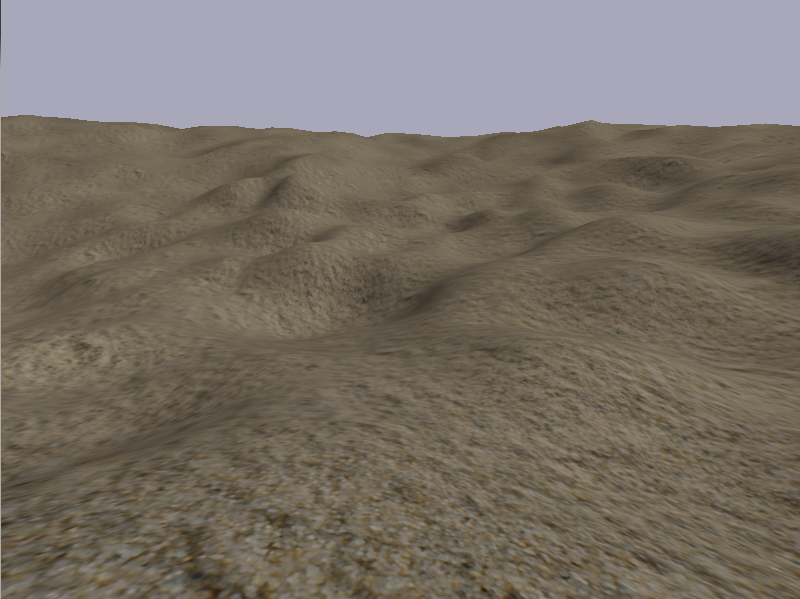
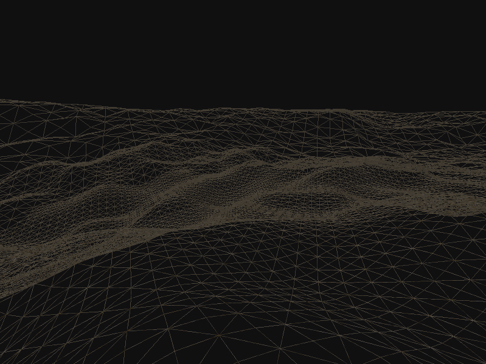

# KIV/ZPG - Pohoda na sahaře

Semestrálka na Základy Počítačové Grafiky - zimní semestr 2012. Průchod pouštní krajinou
vygenerovanou bitmapovým souborem za použití OpenGL.

* Implementace v java 6 + [LWJGL - Lightweight Java Graphics Library](http://www.lwjgl.org/)
* Dokumentace k předmětu - [**doc.pdf**](doc/doc.pdf)
* Featury
  * Vyhlazování terénu pomocí technik Bilinearly blended patch mezi krajními Catmull-Rom křivkami
  * Adaptivní načítání terénu pomocí QuadTree algoritmu
  * Nezobrazování objektů mimo pohled hráče - View Frustrum Culling
  * Denní osvětlení podle polohy "slunce"
  
## Přeložení a spuštění hry
Pomocí ant skriptu (build.xml) stačí použít pár jednoduchých příkazů ke spuštění hry.

```bash
# Kompilace
ant compile

# Spuštění
ant run

# nebo
java -jar bin/ZPG_A10B0632P.jar
```

## Screenshoty
<p align="center">
 
 
</p>

## Detaily kurzu
* KIV/ZPG - Základy počítačové grafiky
* Katedra informatiky a výpočetní techniky
* Fakulta Aplikovaných Věd - ZČU Plzeň (University of West Bohemia)
* Zimní semestr 2012
* Vyučující - [prof. Ing. Václav  SKALA, CSc.](http://www.vaclavskala.eu/)
